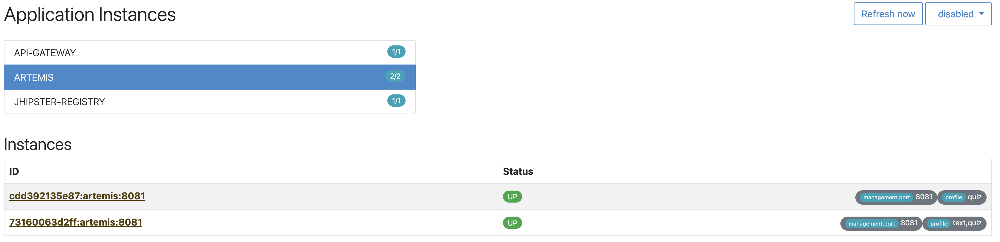

# Profile Based Routing (POC)

This is a proof-of-concept to demonstrate how the Artemis services can be auto-discovered and traffic being routed based on the active Spring Profiles.

## Getting Started

1. Build the API-Gateway and the Artemis-Service:
```bash
cd api-gateway/ && ./gradlew build && cd ../artemis && ./gradlew build
```
2. Run the following command:
```bash
docker compose up -d
```
3. Access the JHipster registry at [http://localhost:8761](http://localhost:8761/registry/applications) and verify that it looks like this:


See that the two Artemis services have different Spring Profiles enabled.

4. Wait for a few seconds.
5. Access the functionality of the QuizController by calling [/api/quiz](http://localhost:8080/api/quiz) in your browser. This is provided by both artemis instances.
6. Verify that there is a response and by spamming the requests, the response changes (different instance name).
7. Repeat the same for [/api/quiz](http://localhost:8080/api/text). However, here, only `artemis-1` should be part of the response string as only this service has enabled this profile.
8. Open [/profiles](http://localhost:8080/profiles) to see the active Artemis profiles of the API-Gateway (cluster-aggregated).

**Note**: If you see a 503 response, you might just need to wait a little bit more until the API gateway has fetched the available service instances from Jhipster Registry.

## How it works

### Actual Routing Logic

Since all artemis instances have the same service name ("ARTEMIS"), we need to decide for each request where to route.

This is what the [CustomLoadBalancer.java](api-gateway/src/main/java/de/example/api-gateway/CustomLoadBalancer.java) does. 
It uses the Spring Profiles to decide where to route the request based on the path prefix.

This will override the default behavior of round-robin load-balancing.
To overcome this, `ServiceInstance#pickBasedOnPathOrAttribute()` performs simple round-robin based on a general (1) and a per-module (2) round-robin counter.

### Minor Details

- The [CustomLoadBalancerConfig.java](api-gateway/src/main/java/de/example/api-gateway/CustomLoadBalancerConfig.java) is just used to enable the `CustomLoadBalancer` for the `ARTEMIS`-services.
- Performance should be non-critical. In case it is, we could consider caching the service instances (to module mapping) for a certain amount of time.
